## Motion Face Detect by Live Video Analysis and Face API

This article walks you through the steps to use Azure Live Video Analytics on IoT Edge for motion detect and use Azure Face API to recognize face. It uses a Linux VM in Azure as an IoT Edge device and a simulated live video stream. This video stream is analyzed for the presence of moving human. When motion is detected, will call face API to recognize person. All of events are sent to Azure IOT Hub along with notification to Microsoft Teams by Azure Logic App, and the relevant part of the video stream is recorded as an asset in Azure Media Services. 

E2E Architect for Motion Face Detect with Azure LVA and Azure Face API 

(current only support x86/AMD devices)

#### Prerequisites

- Download this lab folder as Zip and Unzip to your local folder. 

- An Azure account with an active subscription. [Create an account for free](https://azure.microsoft.com/free/?WT.mc_id=A261C142F).

- [Visual Studio Code](https://code.visualstudio.com/) on your machine with [Azure IoT Tools extension](https://marketplace.visualstudio.com/items?itemName=vsciot-vscode.azure-iot-tools).

- Completed the [Getting Started quickstart](https://docs.microsoft.com/en-us/azure/media-services/live-video-analytics-edge/get-started-detect-motion-emit-events-quickstart) 

  go through the following steps:

  - [Set up Azure resources](https://docs.microsoft.com/en-us/azure/media-services/live-video-analytics-edge/get-started-detect-motion-emit-events-quickstart#set-up-azure-resources)
  - [Deploy modules](https://docs.microsoft.com/en-us/azure/media-services/live-video-analytics-edge/get-started-detect-motion-emit-events-quickstart#deploy-modules-on-your-edge-device)
  - [Configure Visual Studio Code](https://docs.microsoft.com/en-us/azure/media-services/live-video-analytics-edge/get-started-detect-motion-emit-events-quickstart#configure-the-azure-iot-tools-extension)

  When you complete the steps above, the service would list in azure portal as below.

  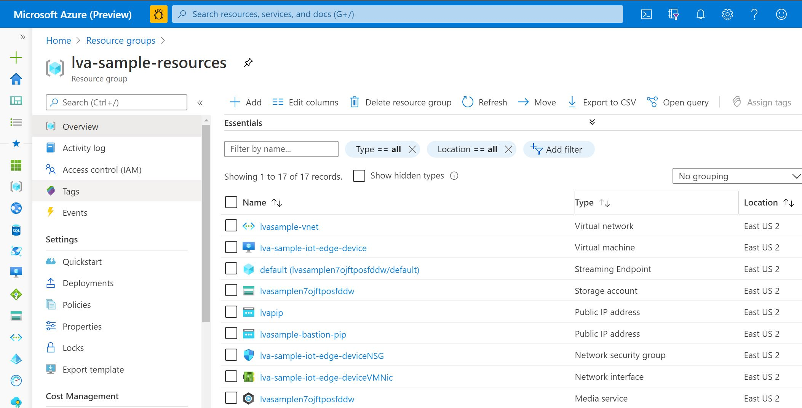

#### Review the sample video

You can download [sample video](video/lvatest2.mkv) and copy to Linux VM in Azure being used as the IoT Edge device. This video file will be used to simulate a live stream for this tutorial.

`scp {local folder}/lvatest2.mkv lvaadmin@lvasvr.eastus2.cloudapp.azure.com:/home/lvaadmin/samples/input`

#### Setup IOT Edge module and config face API

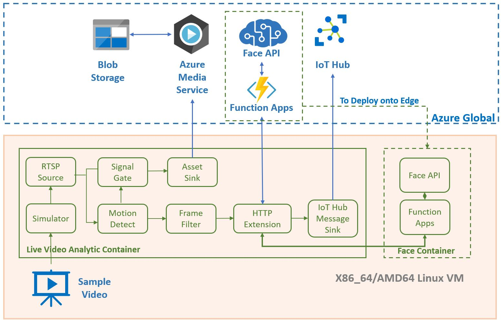

When you complete the steps below, you will have used Live Video Analytics on IoT Edge to detect motion and do facial recognition of the human in RTSP source.

- Setup azure face cognitive service 

  - Create a new face cognitive service under **lva-sample-resources** resource group on azure portal. 

    

  - Train face api with provided person image names **Anne.jpg** under images folder, regards **Quickstarts -> Using the client library** [link](https://docs.microsoft.com/en-us/azure/cognitive-services/face/quickstarts/client-libraries?pivots=programming-language-python)

- Setup azure function app to call Face API to detect and recognize person. 

  - Login [azure portal](https://ms.portal.azure.com/) to create an azure function 

    - resources group **lva-sample-resources** 
    - region **EAST US**
    - Runtime **Python**
    - Version **3.6**
    - Function Name is flexible 

    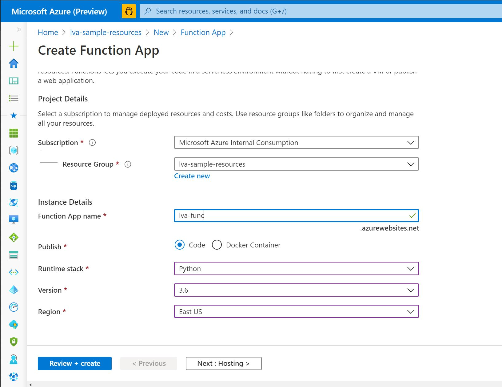

    - Add a new function under function app names **facefunnew**

      

  - Open VS code and click open downloaded lab file folder, and Unzip **facefunnew** to current folder

    `{your local folder}/func/facefunnew`

  - Modify init.py with created face services' {Face API Name} and {Face API Key} in below section

    

  - Click **F1** and entry **Sign In** to sign in your azure account

    

  - Right click sub folder facefunnew and select **Deploy to Funciton App**

    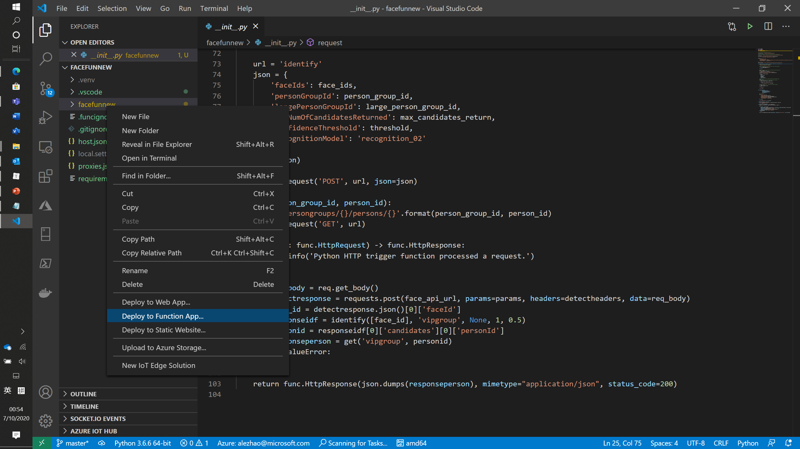

  - Select Function App you just created from output panel

    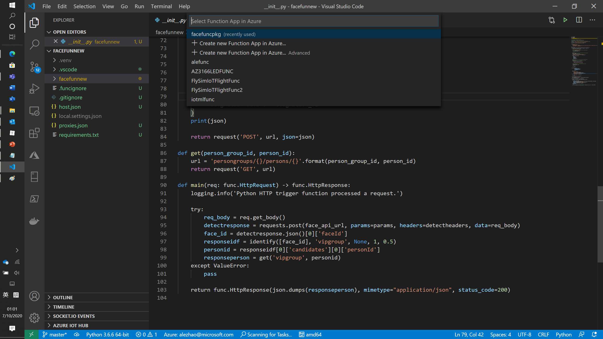

  - Click **Deploy** from output window and wait for deploy complete notification.

    

- Invoke **GraphTopologyList**

  - Right click **lvaEdge** from Azure IOT Edge you generated by initial scripts under **AZURE IOT HUB** section in VS code, and click **Invoke Module Direct Method**

    

  - Entry **GraphTopologySet** and click **Enter**

  - Copy all of content of **InferencingFaceApi.json** from scripts folder and paste to output panel and click **Enter**

    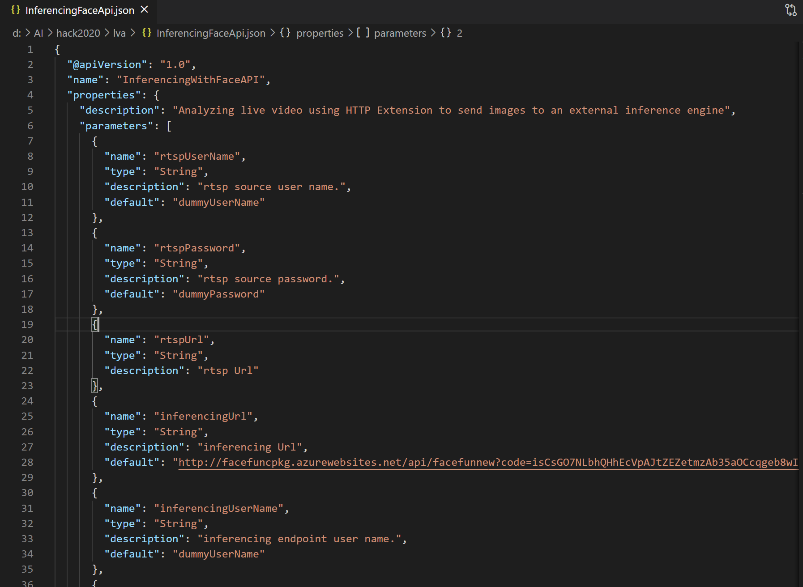

  - Wait until get status 200 from output terminal window.

    

- Invoke **GraphInstanceSet**

  - Right click **lvaEdge** from Azure IOT Edge you generated by initial scripts under **AZURE IOT HUB** section in VS code, and click **Invoke Module Direct Method**

  - Entry **GraphInstanceSet** and click **Enter**

  - Entry scripts below into output panel and click **Enter**

    `{
      "@apiVersion": "1.0",
      "name": "Sample-Graph-FaceApi",
      "properties": {
        "topologyName": "InferencingWithFaceAPI",
        "description": "Sample graph description",
        "parameters": [
          {
            "name": "rtspUrl",
            "value": "rtsp://rtspsim:554/media/lvatest2.mkv"
          }
        ]
      }
    }`

  - Wait until get status 200 from output terminal window.

- Invoke **GraphInstanceActivate**

  - Right click **lvaEdge** from Azure IOT Edge you generated by initial scripts under **AZURE IOT HUB** section in VS code, and click **Invoke Module Direct Method**

  - Entry **GraphInstanceActivate** and click **Enter**

  - Entry scripts below into output panel and click **Enter**

    `{
        "@apiVersion" : "1.0",
        "name" : "Sample-Graph-FaceApi"
    }`

  - Wait until get status 200 from output terminal window.

- Right click your edge device **lva-sample-device** and click **Start Monitoring Built-in Event Endpoint** to start monitor motion detect and facial recognition telemetry data send to Azure IOT HUB. 

  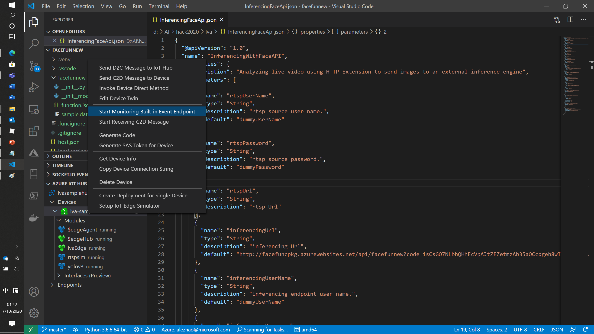 

  you would get payload like below

  `{"personId":"90a1192d-f784-4c73-bd58-5f33dc802ede","persistedFaceIds":["2edd580b-8feb-462b-b3e3-8b04502e0dbb","62b929a8-b0ea-4df2-b621-e0e9c5bd0d94","f28187e2-5343-4d63-9ad9-cfdf209fdbda"],"name":"Anne","userData":"User-provided data attached to the person."}`

- Open **Azure Media Service** which generated by initial script on Azure portal and click **Assets (new)** in left panel. 

  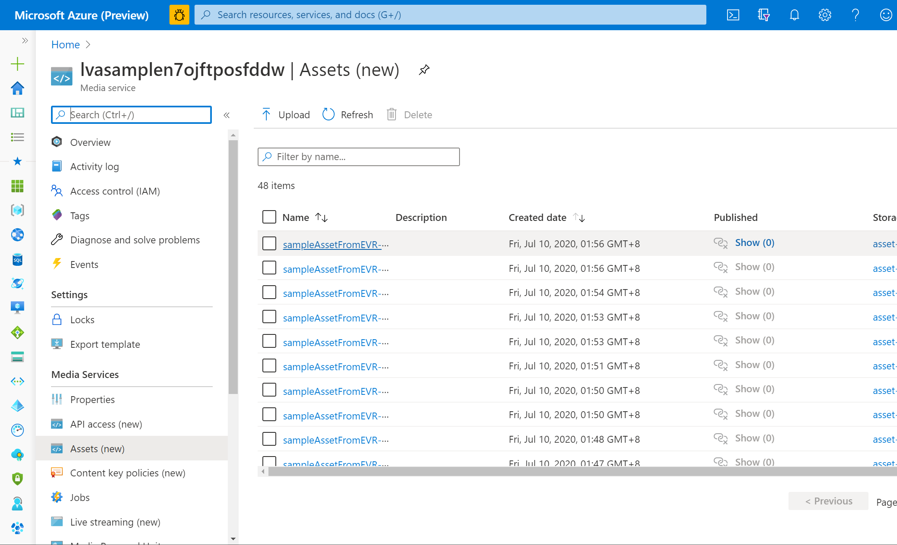

- Verify split video stream in **Azure Media Service**, which should have person included. 

#### Setup Logic App to notify telemetry to Microsoft Teams

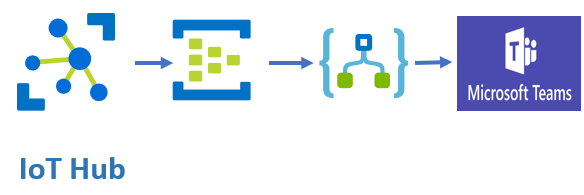

When you complete the steps below, you will get notification from **Microsoft Teams** once person detect by live video analysis. 

- Create a new **Event Hubs** under resources group **lva-sample-resources** on Azure portal

  - name **lvaeventhubs**

- Create a new **Event Hub** under **lvaeventhubs** you just created. 

  - name **lvaeventhub**

- Config IOT HUB to route telemetry message to pervious created event hub **lvaeventhub**

  - Open IOT HUB **lvasamplehubn7ojftposfddw** under resources group **lva-sample-resources**, and click **Message routing ** in left panel

    

  - Click Add a new **Routes**, and entry a name, and select event hub endpoint **lvaeventhub** you just created. 

    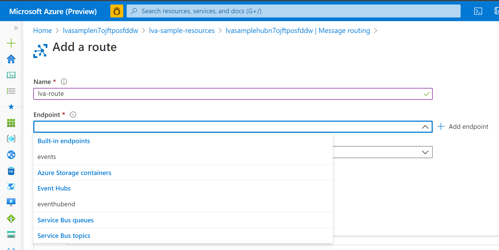

  - Click **Create**

- Config Logic App to trigger events from event hub **lvaeventhub** and send to **Microsoft Teams**

  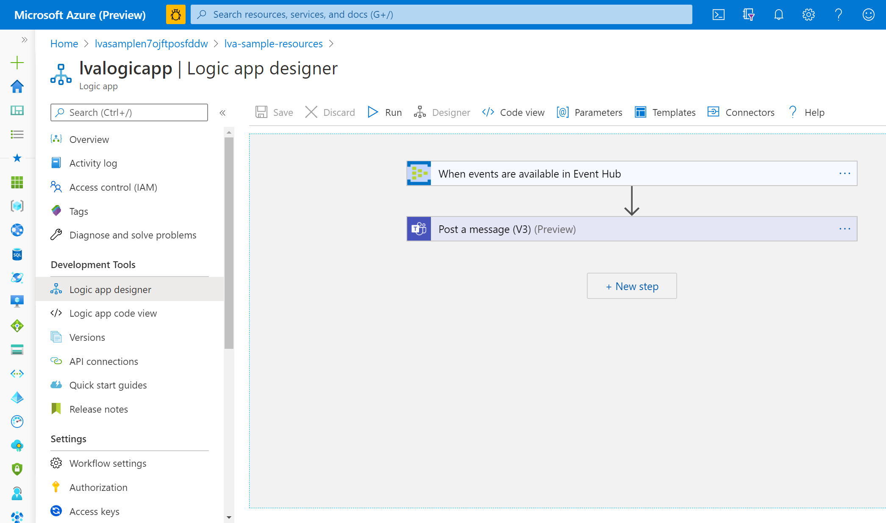

  - Create a new Logic App names **lvalogicapp** under resources group **lva-sample-resources** from Azure portal

  - Create a **Blank Logic App** at output design panel. 

  - Select input trigger with action **When events are available in Event Hub**, and select event hub **lvaeventhub**  you created in pervious step 

  - Select next action with **Microsoft Teams** and select method **Post a message (V3) (Preview)** 

    You might need sign in teams with your azure account from output window

  - Select **Microsoft Teams** Channel you want to post and select Content into **Message** panel.

    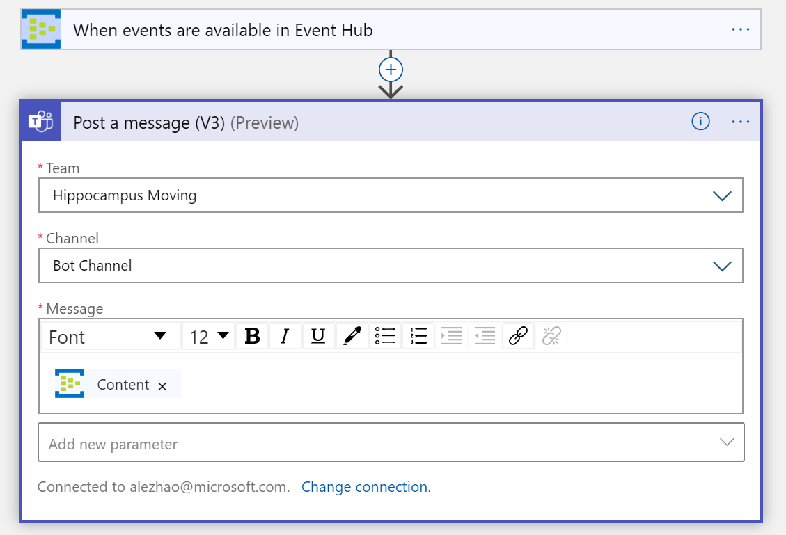

  - Verify telemetry message coming into **Microsoft Teams**

    

#### Deactivate Live Video Analysis Instance

-  Invoke **GraphInstanceDeactivate**

  - Right click **lvaEdge** from Azure IOT Edge you generated by initial scripts under **AZURE IOT HUB** section in VS code, and click **Invoke Module Direct Method**

  - Entry **GraphInstanceDeactivate** and click **Enter**

  - Entry scripts below into output panel and click **Enter**

    `{
        "@apiVersion" : "1.0",
        "name" : "Sample-Graph-FaceApi"
    }`

  - Wait until get status 200 from output terminal window.
