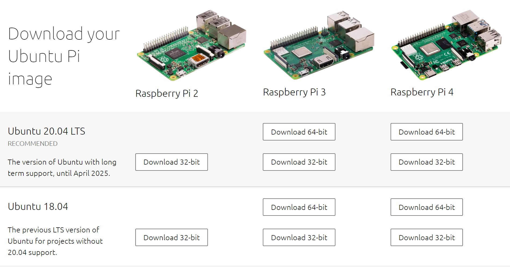
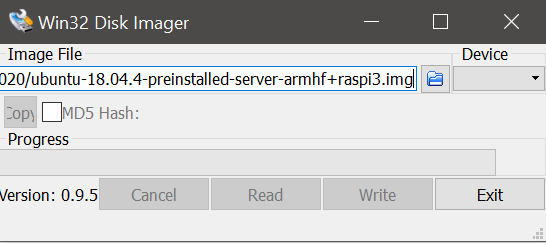
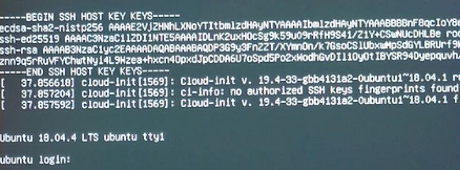
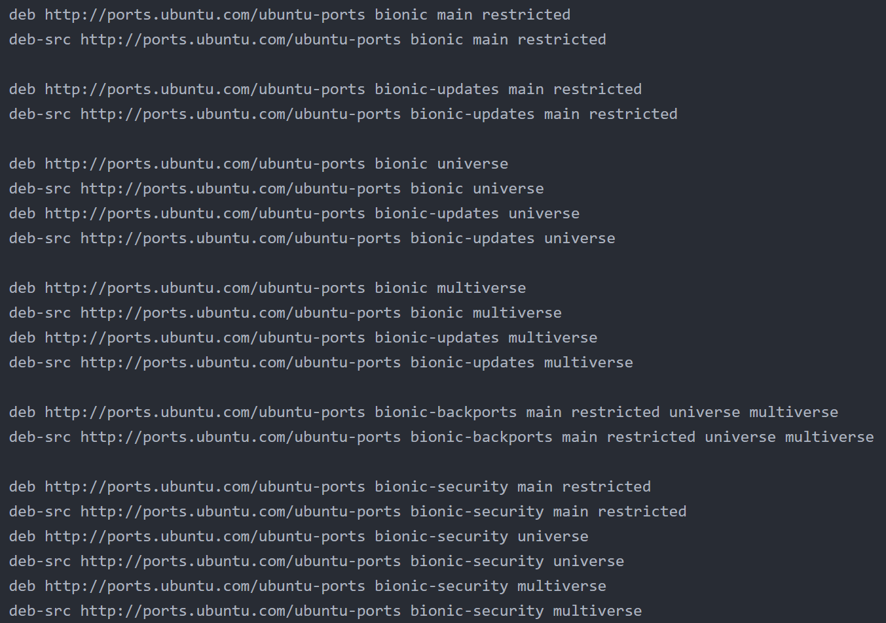

## Install Ubuntu 18.04 32bit GUI onto Raspberry Pi 4B 

#### Overview

This lab is build for how to install Ubuntu 18.04 32bit with GUI onto Raspberry Pi 4B, as Ubuntu 20.04 GUI still has issues so recommend to install 18.04 currently. 

#### Preparation Before Start 

Raspberry Pi 4B

microHDMI2HDMI 

Display Monitor

Mouse

Keyboard

microSD card <128G (Raspberry Pi 4 only support maximum 128G )

microSD card reader

WAN capable

#### Quick Start

1. ##### Download [Ubuntu 18.04 Image](https://ubuntu.com/download/raspberry-pi)

   

   If your microSD card RAM > 4G, recommend install 64bit otherwise 32bit only recognize 3.5G RAM

   * Unzip image file from downloaded package

2. ##### Burning OS

   * Download [Win32 Disk Image](https://sourceforge.net/projects/win32diskimager/)  and install
   * Plug-in your microSD card with read to PC
   * Open Win32 Disk Image, select Ubuntu 18.04 32bit image which you unzipped 

   * Click **Write** 

3. ##### Install OS

   * Plug-in your microSD card into Raspberry Pi 4B 

   * Power On Raspberry Pi as below

     

   * Login default account with username: ubuntu password: ubuntu, system will ask to change password at first login. 

   * If you located in China, please change APT source to Ali cloud

     * `sudo vim /etc/apt/sources.list`

       

     * Update **ports.ubuntu.com** to **mirrors.aliyun.com**

       ***/ubuntu-ports** regards arm bin, **/ubuntu** regards x86 x64 bin. replace regards your core. Do not need update in this lab*

       `:%s/ports.ubuntu.com/mirrors.aliyun.com/g`

       `:wq`

       

     * `sudo apt-get update` 

       `sudo apt-get upgrade`

   * Install Ubuntu 18.04 GUI 

     `sudo apt install ubuntu-desktop` 

     If output error, there has 2 option workaround:
   
     * change source list back to official source from Ali cloud if need, then install GUI again
   
       `sudo vim /etc/apt/sources.list`
   
       `:%s/mirrors.aliyun.com/ports.ubuntu.com/g`
   
       `:wq`
   
       `sudo apt-get update`
   
       `sudo apt-get upgrade` 
   
       `sudo apt install ubuntu-desktop`
   
   * Reboot and login Ubuntu GUI
   
     `sudo reboot`

